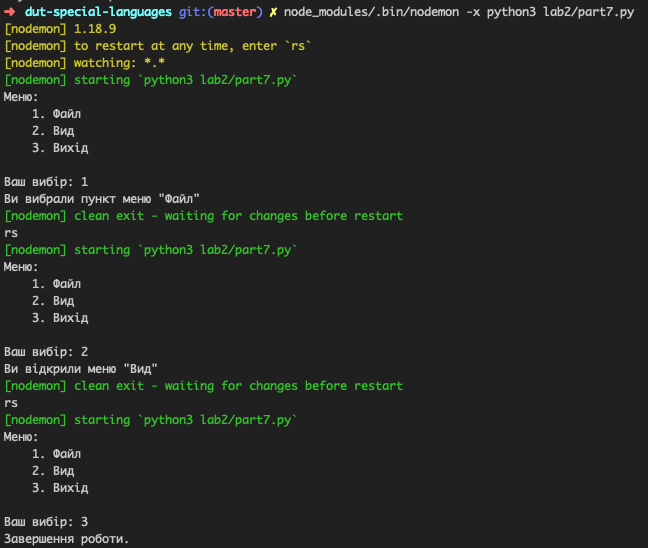

# Лабораторная работа 1
## Постановка задачи
Самостійно на ПК реалізувати програмний код наведений нижче

## Ход выполнения
Код был разделен на несколько программ, которые были выполнены отдельно. Результаты видно на скриншотах
### screenshots 1

### screenshots 2

### screenshots 3

### screenshots 4

### screenshots 5

### screenshots 6

### screenshots 7

### screenshots 8

### screenshots 9

### screenshots 10

### screenshots 11

